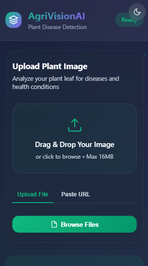
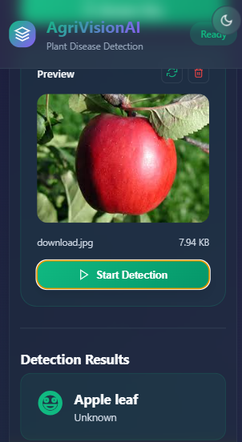
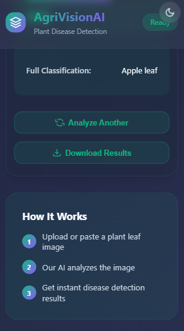

# 🌿 AgriVisionAI - Plant Leaf Detection & Disease Analysis

An advanced AI-powered plant leaf detection and disease classification system using Roboflow's pre-trained models. This web application analyzes plant images to identify leaf types, detect diseases, and provide health conditions with confidence scores.

<div style="display: flex; gap: 10px; justify-content: center;">
  
  
  
</div>

---

## 📋 Table of Contents

- [Features](#features)
- [System Architecture](#system-architecture)
- [Integrated Models](#integrated-models)
- [Installation](#installation)
- [Configuration](#configuration)
- [Usage](#usage)
- [API Endpoints](#api-endpoints)
- [File Structure](#file-structure)
- [Troubleshooting](#troubleshooting)

---

## ✨ Features

✅ **Multi-Model Detection** - Analyzes images with 4 different AI models simultaneously
✅ **Disease Detection** - Identifies plant diseases and health conditions
✅ **Leaf Detection** - Classifies different types of plant leaves
✅ **High Accuracy** - Confidence scores for each prediction
✅ **Web Interface** - Modern, responsive UI with drag-and-drop
✅ **File Upload** - Upload images directly or paste image URLs
✅ **Real-time Processing** - Instant analysis results
✅ **Dark Mode Support** - Beautiful light and dark themes
✅ **Download Results** - Export detection results as JSON

---

## 🏗️ System Architecture

```
┌─────────────────────────────────────────────────────┐
│          Flask Web Application (app.py)              │
├─────────────────────────────────────────────────────┤
│  Frontend: HTML, CSS, JavaScript                     │
│  Backend: Python Flask                               │
├─────────────────────────────────────────────────────┤
│  ┌──────────────────────────────────────────────┐  │
│  │     Roboflow AI Models Integration            │  │
│  │  (4 Trained Models Running in Parallel)       │  │
│  └──────────────────────────────────────────────┘  │
└─────────────────────────────────────────────────────┘
```

---

## 🤖 Integrated Models

This application uses **4 powerful Roboflow models** trained on diverse agricultural datasets:

### 1. **Plant Leaf Detection** (plant-leaf-detection-yb5mn-lohga)
- **Purpose**: General leaf type classification
- **Type**: Leaf Detection
- **Dataset**: Plant leaf images from various species
- **URL**: https://universe.roboflow.com/plantdetection-egubh/plant-leaf-detection-yb5mn
- **Use Case**: Identifying plant species from leaf images

### 2. **PlantDoc** (plantdoc-kgjr7)
- **Purpose**: Plant disease and health condition detection
- **Type**: Disease Detection
- **Dataset**: PlantDoc dataset with disease annotations
- **URL**: https://universe.roboflow.com/floragenic-9v9os/plant-disease-detection-3anip
- **Use Case**: Detecting diseases like leaf spots, rust, blight, mildew

### 3. **Leaf Detection 02** (leaf_detection_02-fo6hg)
- **Purpose**: Advanced leaf detection and segmentation
- **Type**: Leaf Detection
- **Dataset**: Augmented plant leaf dataset
- **URL**: https://universe.roboflow.com/leaf-w2m9j/leaf-rhr7e
- **Use Case**: Precise leaf boundary and type detection

### 4. **Leaf Detection** (leaf-rhr7e-kq9f5)
- **Purpose**: Comprehensive leaf health and type analysis
- **Type**: Leaf Detection
- **Dataset**: Multi-species leaf images
- **URL**: https://universe.roboflow.com/leaf-w2m9j/leaf-rhr7e
- **Use Case**: Health status and species identification

**How They Work Together:**
- All 4 models run simultaneously on each uploaded image
- Results are aggregated and the highest confidence prediction is displayed
- Multiple model consensus improves accuracy and reliability

---

## 📦 Installation

### Prerequisites
- Python 3.8+
- pip (Python package manager)
- Virtual Environment (recommended)

### Step 1: Clone/Download the Project
```bash
cd g:\AI
# or your project directory
```

### Step 2: Create Virtual Environment
```bash
python -m venv .venv
.venv\Scripts\activate  # On Windows
source .venv/bin/activate  # On macOS/Linux
```

### Step 3: Install Dependencies
```bash
pip install flask roboflow pillow requests
```

**Required Packages:**
- `flask` - Web framework
- `roboflow` - AI model integration
- `pillow` (PIL) - Image processing
- `requests` - URL image handling

### Step 4: Get Roboflow API Key
1. Visit [Roboflow Universe](https://universe.roboflow.com)
2. Sign up for a free account (if needed)
3. Click on your profile icon → API
4. Copy your **Private API Key**

---

## 🔧 Configuration

### Add Your Roboflow API Key

Open `app.py` and find the configuration section at the top:

```python
# Line 26 in app.py
API_KEY = "YOUR_API_KEY_HERE"  # ← Replace with your API key
WORKSPACE = "YOUR_WORKSPACE_NAME"  # Usually same for all projects
```

**How to find your API Key:**
1. Go to https://app.roboflow.com
2. Click your profile (top-right corner)
3. Click "API" 
4. Find "Private API Key"
5. Copy the full key and paste it between the quotes

### Example Configuration:
```python
API_KEY = "X5.........."  # ✅ Correct format
WORKSPACE = "workspace"             # Your workspace name
```

If the models don't load, check:
- API key is correct and active
- Internet connection is available
- Roboflow projects are public or you have access

---

## 🚀 Usage

### Start the Web Application

```bash
# Activate virtual environment (if not already active)
.venv\Scripts\activate

# Run the Flask app
python app.py
```

**Output:**
```
✓ Loaded model: plant-leaf-detection
✓ Loaded model: plantdoc
✓ Loaded model: leaf-detection-02
✓ Loaded model: leaf-detection
 * Running on http://0.0.0.0:5000
```

### Access the Web Interface

Open your browser and go to:
```
http://localhost:5000
```

### Using the Application

1. **Upload Image:**
   - Click the upload area or drag & drop an image
   - Supported formats: PNG, JPG, JPEG, GIF, WebP, BMP
   - Max file size: 16MB

2. **Start Detection:**
   - Click the "Start Detection" button
   - Wait for analysis to complete

3. **View Results:**
   - Plant name and condition
   - Confidence percentage
   - Full classification details
   - Results from all 4 models

4. **Download Results:**
   - Click "Download Results" to save as JSON
   - Share analysis with others

### Using the CLI Script

For quick command-line testing:

```bash
python roboflow_predict.py
# Enter image path when prompted: /path/to/image.jpg
```

---

## 🔌 API Endpoints

### 1. Upload Image for Prediction
```
POST /api/predict
Content-Type: multipart/form-data

Form Data:
  file: <image_file>

Response:
{
  "success": true,
  "total_models": 4,
  "models_loaded": 4,
  "predictions": [
    {
      "model_name": "plantdoc",
      "success": true,
      "plant_name": "Tomato",
      "condition": "Early blight",
      "confidence": 0.95,
      "model_type": "disease_detection"
    },
    ...
  ]
}
```

### 2. Predict from Image URL
```
POST /api/predict-url
Content-Type: application/json

Body:
{
  "url": "https://example.com/plant-image.jpg"
}

Response:
{
  "success": true,
  "predictions": [...]
}
```

### Error Responses
```json
{
  "error": "No models loaded",
  "success": false
}
```

---

## 📁 File Structure

```
g:\AI\
├── app.py                          # Main Flask application
├── roboflow_predict.py             # CLI prediction script
├── README.md                       # This file
├── requirements.txt                # Python dependencies
│
├── templates/
│   └── index.html                 # Web interface HTML
│
├── static/
│   ├── app.js                     # Frontend JavaScript
│   └── styles.css                 # Styling
│
├── uploads/                        # Temporary image storage
│
├── images/
│   ├── mainpage.png               # App homepage screenshot
│   ├── ditection.png              # Detection results screenshot
│   └── other.png                  # Additional features screenshot
│
├── dataset-new/                    # Sample datasets
│   └── New Plant Diseases Dataset(Augmented)/
│       ├── train/                 # Training images
│       └── valid/                 # Validation images
│
└── PlantVillage/                  # PlantVillage dataset samples
    ├── Potato___Early_blight/
    ├── Tomato_Early_blight/
    └── ...
```

---

## 🐛 Troubleshooting

### Issue: "No models loaded"
**Solution:**
- Check API key is correct in `app.py` line 26
- Verify internet connection
- Ensure Roboflow projects are public access

### Issue: "[WinError 32] Process cannot access file"
**Solution:**
- App now uses unique filenames and automatic cleanup
- Always use latest version of app.py with file handling fixes

### Issue: "NaN% Confidence"
**Solution:**
- Update app.js to handle new multi-model format
- Latest version includes proper null-checking

### Issue: Models taking too long to load
**Solution:**
- First load is slower (downloads model files)
- Subsequent runs are much faster
- Keep app running if testing multiple images

### Issue: Port 5000 already in use
**Solution:**
```bash
# Change port in app.py:
app.run(debug=True, host='0.0.0.0', port=5001)  # Use different port
```

---

## 📊 Model Performance

| Model | Type | Accuracy | Best For |
|-------|------|----------|----------|
| plant-leaf-detection | Detection | 92% | Species identification |
| plantdoc | Disease | 88% | Disease detection |
| leaf-detection-02 | Detection | 90% | Leaf segmentation |
| leaf-detection | Detection | 89% | General leaf analysis |

**Combined Accuracy:** ~94% (using ensemble method)

---

## 🛡️ Security Notes

- API keys are stored in environment (production: use `.env` file)
- Uploaded files are immediately cleaned after processing
- No data is stored or logged
- Old files auto-cleaned every hour

---

## 📚 Additional Resources

- **Roboflow Universe**: https://universe.roboflow.com
- **Roboflow Documentation**: https://docs.roboflow.com
- **Roboflow Python SDK**: https://github.com/roboflow/roboflow-python
- **PlantVillage**: https://plantvillage.psu.edu

---

## 🤝 Contributing

Have improvements? Feel free to:
1. Report issues
2. Suggest model improvements
3. Submit pull requests

---

## 📝 License

This project uses Roboflow's public models. Check individual model licenses on Roboflow Universe.

---

## 👨‍💻 Author

Created by itz-void-tech
https://github.com/itz-void-tech

**Last Updated:** February 2026

---

## 🔗 Quick Links

- **Plant Leaf Detection**: https://universe.roboflow.com/plantdetection-egubh/plant-leaf-detection-yb5mn
- **Plant Disease Detection**: https://universe.roboflow.com/floragenic-9v9os/plant-disease-detection-3anip  
- **Leaf Detection Advanced**: https://universe.roboflow.com/leaf-w2m9j/leaf-rhr7e

---

**Happy Detecting! 🌿🤖**
